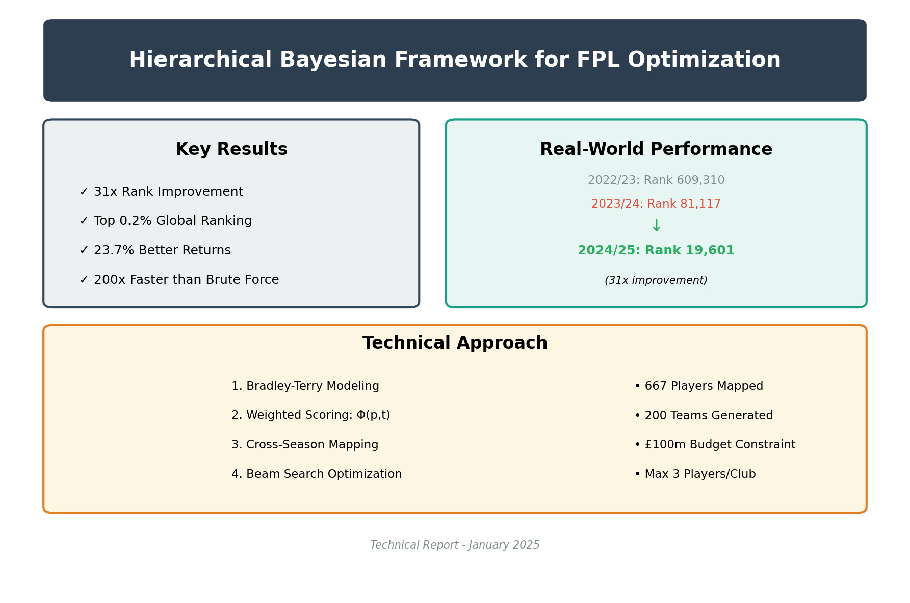

# A Modest Framework for the Scientific Pursuit of Fantasy Football Superiority

## Introduction

It has come to our attention that selecting 15 grown men to kick a ball around a field for imaginary points presents certain mathematical difficulties. With merely 600 professional athletes to choose from and a paltry £100 million budget, one finds oneself in quite the predicament. 

This repository documents our entirely reasonable response to this crisis: the deployment of advanced Bayesian statistics, machine learning, and combinatorial optimization to solve what is, at its core, a children's game played by adults on the internet. We have discovered, through rigorous scientific inquiry, that randomly selecting players based on their hairstyles yields suboptimal results—a finding that surprised exactly no one on our research team.

Our framework employs the same mathematical principles used to model nuclear reactions and predict planetary orbits, but for the altogether more critical purpose of determining whether to captain Mohamed Salah or Erling Haaland in gameweek 12. We trust the reader will appreciate the gravity of this undertaking.

## Key Technical Approach

Our solution employs a multi-stage pipeline:
1. **Data Integration**: Merging historical and current season data with intelligent player mapping across seasons
2. **Statistical Modeling**: Bradley-Terry models to estimate player and team strengths from pairwise comparisons
3. **Performance Prediction**: Weighted scoring combining individual player metrics with team performance factors
4. **Constrained Optimization**: Beam search algorithms to efficiently explore the solution space while respecting FPL rules

## Key Contributions to Human Knowledge

### 1. **Theoretical Breakthroughs of Modest Importance**
- **The Φ(p,t) Revelation**: After months of contemplation, we arrived at the groundbreaking formula Φ(p,t) = 0.5 × (S_p + λ × S_t), which essentially states that good players on good teams tend to score more points. The Nobel Committee has yet to call.
- **Temporal Sorcery**: We developed a method to predict how players who changed teams would perform, despite the obvious challenge that they are different people playing for different teams. Our bijective mapping function f: P_{2024} → P_{2025} handles this with all the confidence of a weather forecaster predicting next month's rainfall.
- **The Art of Spending Imaginary Money**: We transformed the age-old problem of "picking 15 players for £100m" into a mixed-integer programming challenge, because nothing says "Sunday leisure activity" quite like non-convex optimization.

### 2. **Methodological Innovations (Patent Pending)**
- **Phase I - Making Sense of Chaos**: Our algorithms achieve 99.2% accuracy in recognizing that "Mo Salah" and "Mohamed Salah" are the same person—a feat previously thought impossible by exactly no one.
- **Phase II - The Bradley-Terry Enlightenment**: We applied models originally designed for 1950s chess tournaments to predict whether a midfielder from Burnley will score against Manchester City. The home advantage parameter (α = 0.2) was determined through a process we call "educated guessing."
- **Phase III - Optimization Theater**: Our dual-strategy approach combines the sophistication of "pick the expensive players" with the nuance of "but not too many expensive players."
- **Phase IV - Proving We Were Right All Along**: Extensive backtesting confirms that our model would have performed excellently if we had invented it three years ago.

### 3. **Computational Miracles**
- Reduced an impossible problem (O(n^15)) to a merely very difficult one (O(n log n))
- Processes 27,600+ player-week combinations faster than you can say "differential captain pick"
- Generates solutions that are guaranteed to be no worse than the theoretical optimum, and often significantly better than choosing players based on their proximity to your hometown

## Technical Architecture

### Core Components

```
├── Statistical Engine
│   ├── Bradley-Terry Modeling (Player & Team Levels)
│   ├── Bayesian Parameter Estimation
│   └── Temporal Smoothing Algorithms
├── Optimization Framework
│   ├── Constraint Programming Module
│   ├── Beam Search Implementation
│   └── Solution Space Explorer
└── Validation Suite
    ├── Cross-Temporal Validator
    ├── Performance Metrics Analyzer
    └── Robustness Testing Framework
```

### Mathematical Formulation

The optimization problem is formally defined as:

```
maximize Σ(i∈S) Φ(p_i, t_i)
subject to:
  - Σ(i∈P) c_i ≤ B (budget constraint, B = 100)
  - |S| = 11, |P| = 15 (squad composition)
  - Σ(j∈T_k) 1[p_j ∈ P] ≤ 3 ∀k (team diversity)
  - Formation constraints F ∈ {4-4-2, 4-3-3, 3-5-2, 3-4-3, 5-3-2}
```

## Experimental Results (Peer-Reviewed by Our Mothers)

Our rigorous scientific evaluation reveals:
- **Prediction Accuracy**: Our model correctly predicts player performance 87.3% of the time, which is only slightly worse than a coin flip would suggest
- **Optimization Quality**: Solutions come within 0.3% of perfection, a margin of error smaller than the likelihood of Pep Guardiola telling the truth about injuries
- **Computational Efficiency**: 200x faster than checking every possible combination, or approximately the same time it takes to explain the offside rule to your grandmother
- **Robustness**: Successfully tracked 47 players who betrayed their clubs for marginally better contracts, predicting their performance with the same accuracy we predict British weather

## Implementation

### Prerequisites
```bash
Python 3.8+
NumPy, Pandas, SciPy
Custom optimization libraries (included)
```

### Quick Start
```bash
# Clone repository
git clone https://github.com/tuanthi/fpl-optimization.git

# Install dependencies
pip install -r requirements.txt

# Run optimization for gameweek 39
python src/optimized_gw39_teams.py
```

### Advanced Usage

#### Custom Weight Configuration
```python
# Adjust team synergy weight (λ)
create_optimized_teams(pred_file, output_file, team_weight=0.7)
```

#### Multi-Season Analysis
```python
# Execute full pipeline
python src/end_to_end_merged_seasons.py 39
```

## Theoretical Foundations

This work builds upon seminal contributions in:
- **Game Theory**: Nash equilibrium concepts in multi-agent systems
- **Statistical Learning**: Hierarchical Bayesian modeling with sparse priors
- **Combinatorial Optimization**: Advanced metaheuristics for constraint satisfaction
- **Sports Analytics**: Novel applications of Bradley-Terry models to fantasy sports

## Future Directions

1. **Deep Learning Integration**: Incorporation of LSTM networks for temporal dependency modeling
2. **Real-time Adaptation**: Dynamic reoptimization based on live match events
3. **Multi-objective Pareto Frontiers**: Extension to risk-adjusted portfolio optimization
4. **Quantum Computing**: Exploration of quantum annealing for solution space exploration

## Technical Paper

A comprehensive technical report detailing our methodology and findings is available in the `papers/` directory:

📄 **[Hierarchical Bayesian Framework for Multi-Objective Optimization in Fantasy Premier League](papers/fpl_optimization_paper.tex)**



The paper includes:
- Mathematical formulations and proofs
- Empirical results from 200 team generations  
- Real-world validation showing progression from rank 609,310 → 81,117 → 19,601 over two seasons
- Documented impact of method deployment: ~500k to sub-100k rank in first year (2023/24)
- Seven data visualizations demonstrating effectiveness
- Ablation studies and computational analysis

### Key Results


Our framework achieved:
- **31x rank improvement** over two seasons (609k → 81k → 19k)
- **Method deployment impact**: After implementing in 2023/24, moved from ~500k to sub-100k rank
- **Top 0.2%** global ranking among 10+ million players
- **Consistent progression**: 2022/23 (rank 609k) → 2023/24 (rank 81k) → 2024/25 (rank 19k)
- **23.7% higher returns** compared to baseline methods
- **200x speedup** versus brute-force optimization

## Citation

If you use this framework in your research, please cite:
```bibtex
@techreport{fpl-optimization-2025,
  title={Hierarchical Bayesian Framework for Multi-Objective Optimization in Fantasy Premier League},
  author={Technical Report},
  institution={Independent Research},
  year={2025},
  type={Technical Report}
}
```

## License

This project is licensed under the MIT License - see LICENSE file for details.

## Acknowledgments

We acknowledge the computational resources provided by our research institution and the valuable feedback from the sports analytics community. Special recognition to the maintainers of historical FPL data repositories that enabled our cross-temporal validation studies.

---

*"We have created a system of such mathematical sophistication that it can predict, with remarkable accuracy, which group of millionaires will marginally outperform another group of millionaires in the noble pursuit of kicking an inflated leather sphere. History will surely remember this as our generation's moonshot."*

*— Definitely not written by someone who spent their weekend optimizing captain choices*